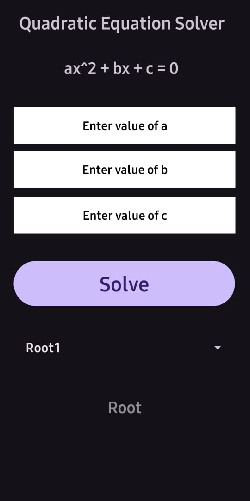
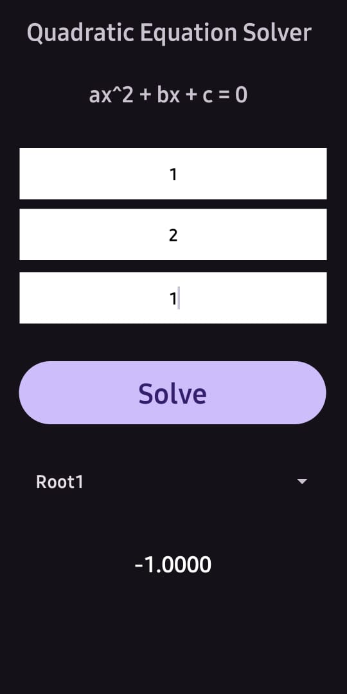
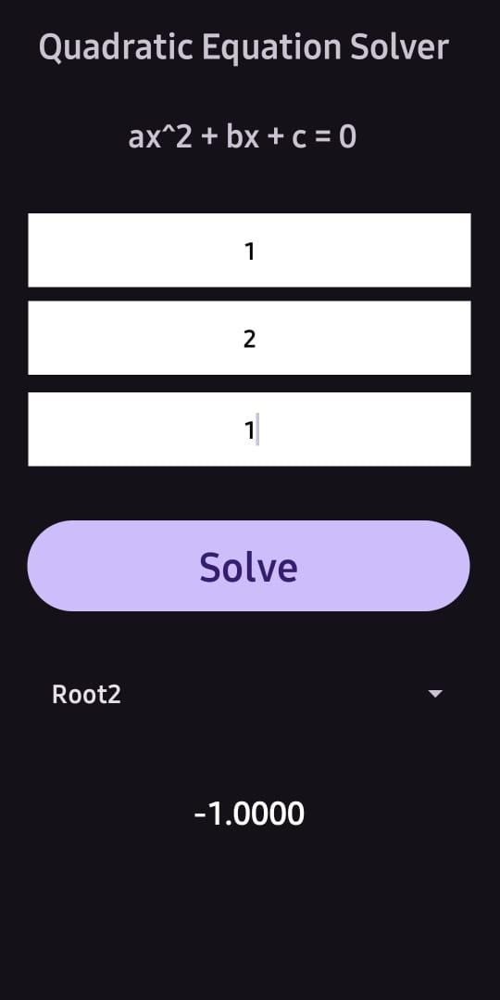
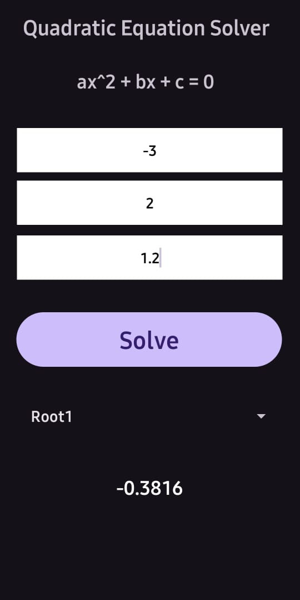
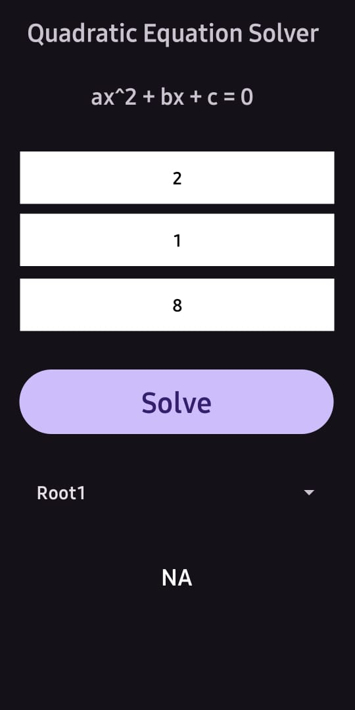
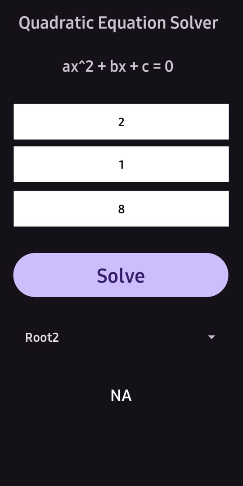

# Mobile Programming
## Assignment 1


### Idea: Quadratic Equation Solver

ax^2 + bx + c = 0 is the general form of a Quadratic equation. Given some value of a, b
and c, one can solve for x using the below equation.

D = b^2 − 4ac

x1 = (− b + √D ) / 2a

x2 = (− b − √D ) / 2a

- In cases where D < 0, the equation can’t be solved. 
- When D = 0, there exists only one solution.
- There are two solutions when D > 0.

### Implementation

#### Activity Main

```xml
<?xml version="1.0" encoding="utf-8"?>
<androidx.constraintlayout.widget.ConstraintLayout xmlns:android="http://schemas.android.com/apk/res/android"
    xmlns:app="http://schemas.android.com/apk/res-auto"
    xmlns:tools="http://schemas.android.com/tools"
    android:id="@+id/main"
    android:layout_width="match_parent"
    android:layout_height="match_parent"

    tools:context=".MainActivity">

    <Button
        android:id="@+id/solveBtn"
        android:layout_width="300dp"
        android:layout_height="69dp"
        android:text="Solve"
        android:textSize="25sp"
        app:layout_constraintBottom_toBottomOf="parent"
        app:layout_constraintEnd_toEndOf="parent"
        app:layout_constraintHorizontal_bias="0.474"
        app:layout_constraintStart_toStartOf="parent"
        app:layout_constraintTop_toTopOf="parent"
        app:layout_constraintVertical_bias="0.551" />

    <TextView
        android:id="@+id/rootText"
        android:layout_width="152dp"
        android:layout_height="36dp"
        android:hint="Root"
        android:textColor="@color/white"
        android:gravity="center"
        android:textSize="20sp"
        app:layout_constraintBottom_toBottomOf="parent"
        app:layout_constraintEnd_toEndOf="parent"
        app:layout_constraintHorizontal_bias="0.498"
        app:layout_constraintStart_toStartOf="parent"
        app:layout_constraintTop_toTopOf="parent"
        app:layout_constraintVertical_bias="0.781" />

    <TextView
        android:id="@+id/titleText"
        android:layout_width="295dp"
        android:layout_height="39dp"
        android:text="Quadratic Equation Solver"
        android:textSize="22sp"
        app:layout_constraintBottom_toBottomOf="parent"
        app:layout_constraintEnd_toEndOf="parent"
        app:layout_constraintHorizontal_bias="0.586"
        app:layout_constraintStart_toStartOf="parent"
        app:layout_constraintTop_toTopOf="parent"
        app:layout_constraintVertical_bias="0.06" />

    <TextView
        android:id="@+id/headingText"
        android:layout_width="165dp"
        android:layout_height="39dp"
        android:text="ax^2 + bx + c = 0"
        android:textSize="20sp"
        app:layout_constraintBottom_toBottomOf="parent"
        app:layout_constraintEnd_toEndOf="parent"
        app:layout_constraintStart_toStartOf="parent"
        app:layout_constraintTop_toTopOf="parent"
        app:layout_constraintVertical_bias="0.147" />

    <EditText
        android:id="@+id/valAText"
        android:gravity="center"
        android:layout_width="300dp"
        android:layout_height="50dp"
        android:background="@color/white"
        android:ems="10"
        android:textColor="@color/black"
        android:hint="Enter value of a"
        android:inputType="text"
        android:textColorHint="@color/black"
        android:textSize="15sp"
        app:layout_constraintBottom_toBottomOf="parent"
        app:layout_constraintEnd_toEndOf="parent"
        app:layout_constraintHorizontal_bias="0.495"
        app:layout_constraintStart_toStartOf="parent"
        app:layout_constraintTop_toTopOf="parent"
        app:layout_constraintVertical_bias="0.246" />

    <EditText
        android:id="@+id/valCText"
        android:layout_width="300dp"
        android:layout_height="50dp"
        android:background="@color/white"
        android:ems="10"
        android:hint="Enter value of c"
        android:gravity="center"
        android:inputType="text"
        android:textColor="@color/black"
        android:textColorHint="@color/black"
        android:textSize="15sp"
        app:layout_constraintBottom_toBottomOf="parent"
        app:layout_constraintEnd_toEndOf="parent"
        app:layout_constraintHorizontal_bias="0.495"
        app:layout_constraintStart_toStartOf="parent"
        app:layout_constraintTop_toTopOf="parent"
        app:layout_constraintVertical_bias="0.418" />

    <EditText
        android:id="@+id/valBText"
        android:layout_width="300dp"
        android:layout_height="50dp"
        android:gravity="center"
        android:background="@color/white"
        android:ems="10"
        android:textColor="@color/black"
        android:hint="Enter value of b"
        android:inputType="text"
        android:textColorHint="@color/black"
        android:textSize="15sp"
        app:layout_constraintBottom_toBottomOf="parent"
        app:layout_constraintEnd_toEndOf="parent"
        app:layout_constraintHorizontal_bias="0.495"
        app:layout_constraintStart_toStartOf="parent"
        app:layout_constraintTop_toTopOf="parent"
        app:layout_constraintVertical_bias="0.33" />

    <Spinner
        android:id="@+id/rootSpinner"
        android:layout_width="300dp"
        android:layout_height="50dp"
        app:layout_constraintBottom_toBottomOf="parent"
        app:layout_constraintEnd_toEndOf="parent"
        app:layout_constraintHorizontal_bias="0.481"
        app:layout_constraintStart_toStartOf="parent"
        app:layout_constraintTop_toTopOf="parent"
        app:layout_constraintVertical_bias="0.672" />
</androidx.constraintlayout.widget.ConstraintLayout>
```

#### Kotlin File

```kotlin
package com.example.qsolver

import android.os.Bundle
import android.provider.DocumentsContract.Root
import android.util.Log
import android.view.View
import android.widget.AdapterView
import android.widget.ArrayAdapter
import android.widget.Button
import android.widget.EditText
import android.widget.Spinner
import android.widget.TextView
import androidx.activity.enableEdgeToEdge
import androidx.appcompat.app.AppCompatActivity
import java.util.Locale
import kotlin.math.pow
import kotlin.math.sqrt

class MainActivity : AppCompatActivity() {
    override fun onCreate(savedInstanceState: Bundle?) {
        super.onCreate(savedInstanceState)
        enableEdgeToEdge()
        setContentView(R.layout.activity_main)

        var root1: Double = Double.NaN
        var root2: Double = Double.NaN
        var flag: String = "Root1"

        val rootSpinner : Spinner = findViewById(R.id.rootSpinner)
        var options = arrayOf("Root1","Root2")
        rootSpinner.adapter = ArrayAdapter<String>(this,android.R.layout.simple_list_item_1,options)

        rootSpinner.onItemSelectedListener = object : AdapterView.OnItemSelectedListener{
            override fun onItemSelected(p0: AdapterView<*>?, p1: View?, p2: Int, p3: Long) {
                flag = options.get(p2)
            }

            override fun onNothingSelected(p0: AdapterView<*>?) {
                flag = "Root1"
            }
        }

        val solveBtn = findViewById<Button>(R.id.solveBtn)
        solveBtn.setOnClickListener {
            var a: Double = findViewById<EditText>(R.id.valAText).text.toString().toDouble()
            var b: Double = findViewById<EditText>(R.id.valBText).text.toString().toDouble()
            var c: Double = findViewById<EditText>(R.id.valCText).text.toString().toDouble()

            if(a == 0.0){
                root1 = -c/b
                root2 = Double.NaN
            }
            else{
                var delta: Double = sqrt(b.pow(2) - (4 * a * c))
                root1 = (-b + delta) / (2 * a);
                root2 = (-b - delta) / (2 * a);
            }

            val rootText = findViewById<TextView>(R.id.rootText)
            if(flag == "Root1"){
                if(root1.isNaN()){
                    rootText.text = "NA"
                }
                else {
                    rootText.text = String.format(Locale.US, "%.4f", root1)
                }
            }
            else{
                if(root2.isNaN()){
                    rootText.text = "NA"
                }
                else {
                    rootText.text = String.format(Locale.US, "%.4f", root2)
                }
            }

        }
    }
}
```

### Screenshots

### Design



### When D = 0





Since there is just one solution, both roots are the same, as you can see in the image.


### When D > 0




There are two valid solutions in this case, as seen above.

### When D < 0





In this case, there are no solutions. Hence, root 1 and root 2 are shown as NA - Not Applicable.


